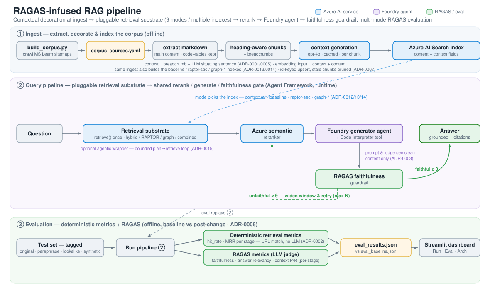
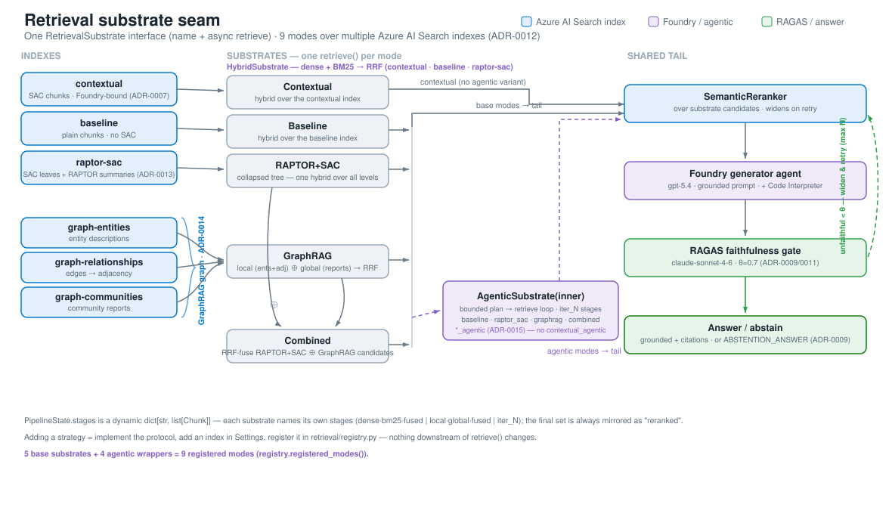
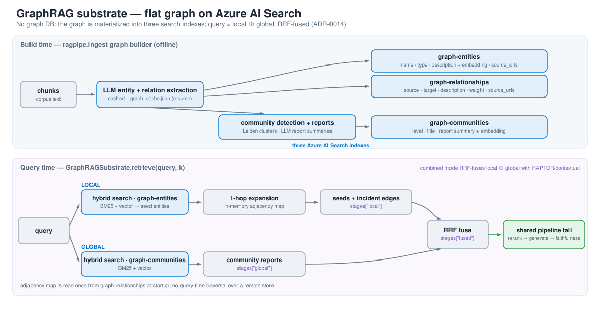
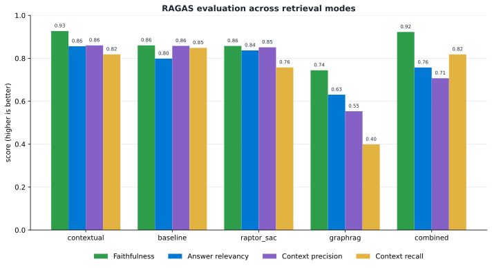

# RAGAS-infused RAG pipeline

Observable hybrid-retrieval RAG over Microsoft/Azure docs, built on Microsoft
Agent Framework + Azure AI Foundry + Azure AI Search, evaluated with RAGAS.



The whole flow: **① Ingest** crawls Microsoft Learn, extracts main content as
markdown (code/tables preserved), splits on headings, decorates every chunk with a
breadcrumb + cached LLM situating context using Anthropic-style per-chunk contextual
retrieval (visible to retrieval only, see
`docs/adr/0001-contextual-chunk-decoration.md`), and indexes it across the substrate
indexes in Azure AI Search (`contextual`, `baseline`, `raptor-sac`, and the three
`graph-*` indexes);
**② Query pipeline** runs a **pluggable retrieval substrate** (ADR-0012) — one of
**9 modes**: `contextual`, `baseline`, `raptor_sac` (RAPTOR collapsed-tree over
Anthropic-contextual leaves; the legacy `sac` token in mode/index names refers to
this implemented per-chunk technique, not per-document SAC from arXiv:2510.06999;
ADR-0013), `graphrag` (flat local+global graph, ADR-0014), `combined`
(RAPTOR ⊕ GraphRAG, RRF-fused), and the four `*_agentic` wrappers (bounded
plan→retrieve loop, ADR-0015) — then a shared tail: Azure semantic rerank → Foundry
generator agent, with a directive RAGAS faithfulness guardrail judged by Claude
(ADR-0009) that widens the rerank window and regenerates on weak grounding, and
abstains when retries exhaust; **③ Evaluation** replays every mode over a tagged test
set and scores deterministic per-stage retrieval metrics (hit rate / MRR) plus the
RAGAS suite, comparing modes head-to-head against a frozen baseline (ADR-0016).

Per-phase deep dives: [① Ingest](docs/pipeline-ingest.svg) ·
[② Query pipeline](docs/pipeline-query.svg) · [③ Evaluation](docs/pipeline-eval.svg). (Source: [`docs/pipeline.svg`](docs/pipeline.svg); the live
runtime workflow graph is also rendered in the dashboard's Architecture tab from
[`docs/pipeline.mmd`](docs/pipeline.mmd).) See the design spec in `docs/superpowers/specs/`.

Substrate deep dives — the multi-index retrieval seam (ADR-0012) and the flat graph
(ADR-0014): [retrieval substrates](docs/retrieval-substrates.svg) · [GraphRAG](docs/graphrag.svg).





## Prerequisites

- [**uv**](https://docs.astral.sh/uv/) (manages Python 3.11+ and dependencies), Azure
  CLI (`az login`), Azure Developer CLI (`azd`), an Azure subscription.

## Setup

```bash
uv sync                      # creates .venv, installs deps + dev tools, from uv.lock
azd up                       # provisions Foundry, Search, model deployments; runs ingestion + agent registration
cp .env.example .env         # then fill from azd outputs
```

`uv sync` installs everything (including dev tools) into `.venv`; prefix project
commands with `uv run` so they use that environment without manual activation.

The Bicep raises the model-deployment capacities (chat=100, embedding=120) above the
default of 10, which is needed for bulk corpus ingestion and offline-eval throughput
(the default throttles to ~1 req/s). They're free on Standard/GlobalStandard — billed
per token, not per capacity.

## Build the corpus

`data/corpus_sources.yaml` is generated by crawling the Azure Microsoft Learn
sitemaps. To (re)build or resize it, then index it:

```bash
uv run python scripts/build_corpus.py [per_service] [cap]   # default 4/service, cap 1000 → ~580 URLs
uv run python -m ragpipe.ingest                             # fetch → extract → chunk → decorate → embed → upload
uv run python -m ragpipe.ingest 3                           # smoke run: first 3 pages, pruning skipped
```

`azd up` runs ingestion automatically; run these manually to refresh the corpus later.

## Run

```bash
uv run streamlit run app/dashboard.py     # Run / Evaluation / Architecture tabs
```

## Serve the HTTP API

The website's RAG demo talks to this service, not Streamlit. It reuses the same
pipeline and the dashboard's pure helper functions.

```bash
uv run uvicorn app.api:app --host 0.0.0.0 --port 8000
```

- `POST /run` `{"query": "...", "mode": "contextual"}` → answer, faithfulness, attempt,
  lowConfidence, abstained, and per-stage chunk tables (`stages` is a dynamic map —
  each substrate names its own stages; the final set is always mirrored under `reranked`).
  `mode` is **required**; an omitted or unknown mode returns 422. Valid modes: `contextual`,
  `baseline`, `raptor_sac`, `graphrag`, `combined`, and the agentic variants `baseline_agentic`,
  `raptor_sac_agentic`, `graphrag_agentic`, `combined_agentic`.
- `POST /run/stream` — same body as `/run`; returns a `text/event-stream` (Server-Sent Events).
  Frames: `event: progress` (one per phase boundary — `retrieve`, `rerank`, `generate`,
  `faithfulness`, `decision`; agentic modes also emit `retrieve.plan` / `retrieve.iter` /
  `retrieve.fuse` sub-rounds), then a terminal `event: result` carrying the same payload as
  `/run`, or `event: error` on failure. Drives the dashboard's live step checklist and external
  web clients.
- `POST /compare` `{"query": "...", "modes": ["contextual", "baseline"]}` → the same payload
  per mode under `results`.
- `GET /eval` → RAGAS metrics from `eval_results.json` (`overall`, `perStage`, `nRecords`).
- `GET /health` → `{"status":"ok"}`.

Requires the same Azure env vars as the pipeline (see `.env.example`). The service is
intended to sit behind the website's Spring backend, which owns rate-limiting and the
daily budget cap — do not expose it publicly unguarded.

## Evaluate

```bash
uv run python -m ragpipe.eval.run         # offline RAGAS harness over data/testset.jsonl

# Compare retrieval modes side by side (ADR-0016). Each mode is replayed over the
# same test set; pass a comma-separated subset (default: contextual,baseline):
uv run python -m ragpipe.eval.run --modes contextual,baseline,raptor_sac,graphrag,combined

# Also score context_precision/recall at each retrieval stage (the substrate's own
# stage names, final mirrored as reranked) — heavier (one judge pass per stage):
PER_STAGE_METRICS=true uv run python -m ragpipe.eval.run
```

Each mode writes a standalone `eval_results_<mode>.json` (suffixed with the mode value,
e.g. `eval_results_graphrag.json`) the moment it finishes; these committed files are the
reference results for each substrate. The combined `eval_results.json` (read by `GET /eval`
and the dashboard) is rebuilt from them at the end and stays gitignored. The per-mode
files double as checkpoints: a re-run skips any mode whose file already exists, so an
interrupted multi-hour run resumes at the next unfinished mode. To regenerate one mode,
delete its `eval_results_<mode>.json` and re-run.

Set `TESTSET_MODE=synthetic` in `.env` to generate the test set from the corpus instead.

Before the first eval run on a new machine:
`uv run python scripts/verify_judges.py` (smokes all three model routes + the
decoration call before any paid run).

Generate synthetic test-item candidates from pages you name (Claude-authored,
overlap-screened; see `docs/adr/0010`):

```bash
uv run python scripts/generate_synthetic_testset.py https://learn.microsoft.com/en-us/azure/search/semantic-search-overview --per-page 5
```

### Evaluation results

The committed per-mode `eval_results_<mode>.json` files render to a single comparison
chart of the four core RAGAS metrics across the evaluated substrates (the `*_agentic`
modes are retrieval wrappers with no standalone eval files, so they're not shown):



Regenerate it after a new eval run with:

```bash
uv run python scripts/plot_eval_results.py   # reads eval_results_<mode>.json → docs/eval-results.svg
```

## Test

```bash
uv run pytest -q
```

## Supported regions & models

Default region is **swedencentral** (see `docs/adr/0008`): it is one of only two
regions (with `eastus2`) where Anthropic Claude models deploy in Microsoft Foundry,
and `gpt-5.4` + `text-embedding-3-small` are available there via
GlobalStandard/DataZone deployments. The Bicep deploys:

- `gpt-5.4` (2026-03-05, GlobalStandard) — generator agent
- `text-embedding-3-small` (GlobalStandard — regional Standard is NOT offered in
  swedencentral; that limitation is what previously forced switzerlandnorth)
- `claude-sonnet-4-6` (preview, GlobalStandard, marketplace-billed) — judges the
  online faithfulness gate (`JUDGE_MODEL`, ADR-0009); requires Azure Marketplace
  access on a pay-as-you-go subscription, and the first deployment may need a
  one-time marketplace offer acceptance in the portal
- `DeepSeek-V4-Pro` (preview, GlobalStandard, sold directly by Azure) — offline
  RAGAS judge (`OFFLINE_JUDGE_MODEL`); third family so offline scores are
  independent of both the generator and the gate (ADR-0009)

Other allowed regions (`infra/main.bicep` `@allowed`) work for the OpenAI-only
stack, but Claude deploys only from swedencentral/eastus2.
